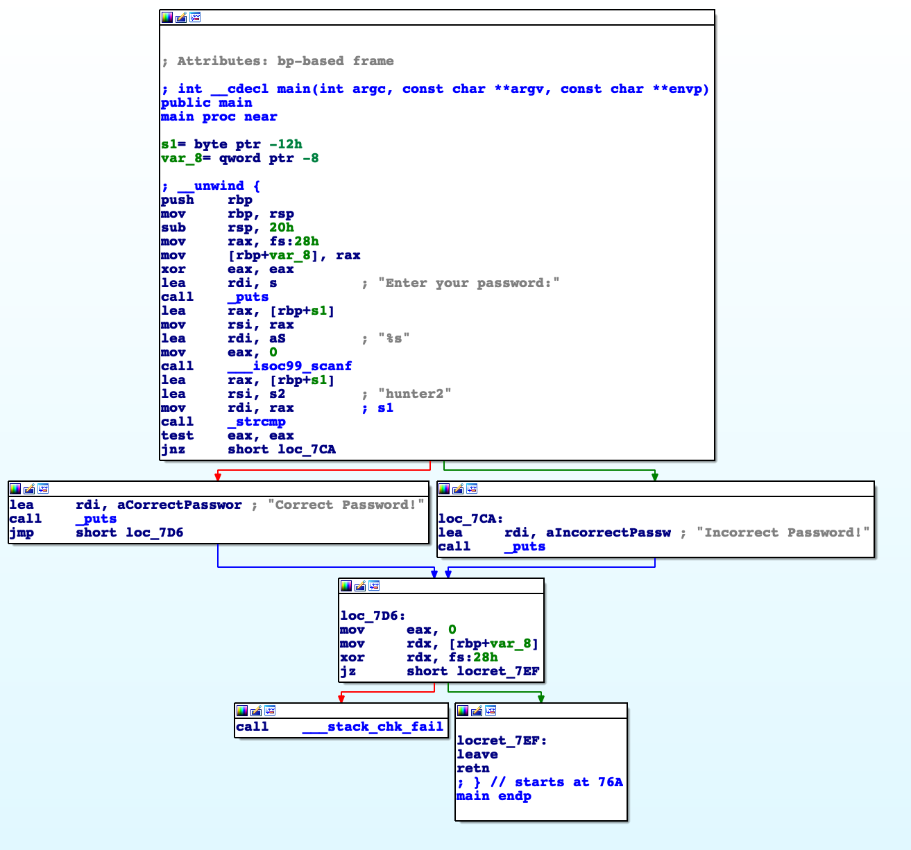

## **Symbolic Execution**

When reverse engineering a program, we can usually find "win conditions" fairly easily, but understanding the logic well enough to actually get to them is much more difficult (this is especially true in CTF challenges where we need to generate a serial key/password). Luckily for us, symbolic execution is a technique developed just for situations like this.

### **Symbolic Execution 101**

Symbolic execution engines allow us to specify an address we want to reach, and will do all the heavy lifting of figuring out what input will get the program to actually reach that address. While this may seem like witchcraft, the basic steps are surprising intuitive:

1. Construct a CFG (Control Flow Graph)
2. Search the graph for a path to the basic block containing our desired address
3. Make a list of all conditionals we run into on that path
4. Pass this list of conditionals to a [constraint solver](./constraint_solving.md)


##### **1) Constructing a CFG**

A CFG represents program logic through branching nodes. This representation is often used to make it easier for us as humans to understand a program, but in this case it allows us to run the searching algorithms that form the backbone of symbolic execution.




##### 2) Searching Basic Blocks

As I'm slowly starting to realize, the entire field of computer science is secretly just more and more advanced algorithms to search for nodes on a graph. By constructing a CFG in step 1, we set ourselves up to run all sorts of path finding algorithms on our program. Once we have a path to reach our desired address, we can start to actually generate the input which will cause the program execution to actually follow this path.


##### 3) Finding Conditionals

Every branch in the CFG represents some sort of conditional statement. As such, the path which we found in step 2 contain which conditional branches we follow, and which ones we do not. From this information, we can begin to infer ground truths about what must be true and must be false about our input. These ground truths are called constraints.


##### 4) Constraint Solving

Now that we have a list of constraints, the next step is to pass it to a  [constraint solver](./constraint_solving.md). This step is where the magic happens — by passing our constraints to an SMT solver, we can start to generate the input to actually reach our desired block of code.


### Symbolic Execution Engines

Despite the complexity of symbolic execution, most engines do all the heavy lifting for us. For example, here's an [angr](https://github.com/angr/angr) script to do everything we just discussed in less than 20 lines of python.

```python
import angr
import sys

project = angr.Project('./crackme')

#boilerplate code
initial_state = project.factory.entry_state()
simulation = project.factory.simgr(initial_state)

find_address = 0xdeadbeef
simulation.explore(find=find_address)

if simulation.found:
    solution_state = simulation.found[0]
    print(solution_state.posix.dumps(sys.stdin.fileno()))
else:
    raise Exception('Could not find the solution')
```

While angr is by far the most widely used engine out there, it's worth mentioning that there are other options out there. For example, [Manticore](https://github.com/trailofbits/manticore) takes a more automated approach and can even be run as a standalone application to automatically explore code paths. On the other hand [Triton](https://github.com/JonathanSalwan/Triton) takes a more manual route, instead of acting as a one size fits all tool for symbolic execution.


### Why It's not a Silver Bullet

Unfortunately, all symbolic execution engines have one thing in common — they don't scale very well. While angr may work fine on a small crackme challenge in a CTF, the sheer complexity of most real world binaries causes it to choke. 

In a perfect world, CFGs would look like this:


But sometimes they look more like this:


As the number of branches increases, so does the number of states which angr must keep track of, and the complexity of the problem increases exponentially. While angr may *eventually* find a valid solution to these massive problems, doing so takes an enormous amount of time and memory. Hopefully, advancements in algorithms and hardware will make this technique practical to use on larger problems in the future.


### Additional Resources

[Great Series on Solving Challenges with Angr](https://github.com/jakespringer/angr_ctf)